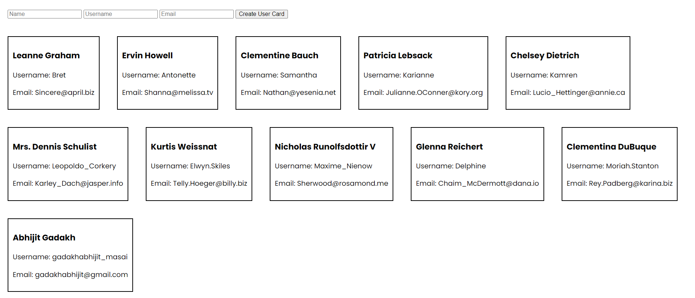

# User Card App
A dynamic web application showcasing user cards. Users can view existing user profiles and add new users through a simple form. The application allows seamless interaction, displaying user information elegantly.

# Features
Display Existing Users: View user profiles on page load.
Add New Users: Fill out a form to add a new user with their name, username, and email address.
Responsive Design: Ensures a seamless user experience across different devices.

# Technologies Used
HTML5: Structure for web pages.
CSS3: Styling for enhanced visual appeal.
JavaScript: Provides interactivity and dynamic content generation.

# How to Use
Clone the repository to your local machine.
Open the index.html file in a web browser.
Explore existing user profiles and add new users using the provided form.

# Screenshot

